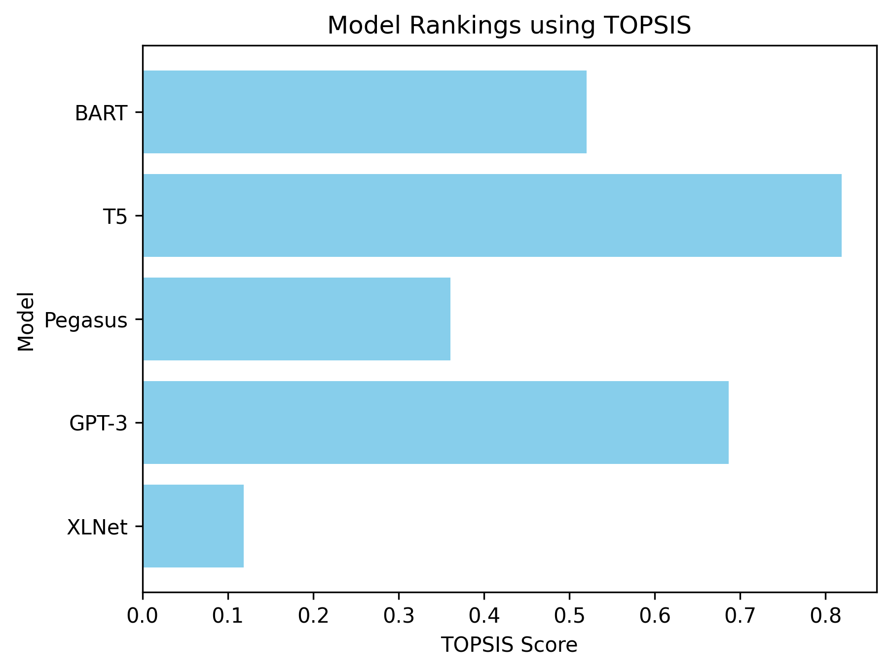

# TOPSIS-Based Model Selection for Text Summarization

This repository contains the implementation of the TOPSIS (Technique for Order of Preference by Similarity to Ideal Solution) method to evaluate and rank pre-trained models for text summarization based on multiple metrics.


---

## **Overview**
This project evaluates pre-trained models for text summarization based on key metrics such as ROUGE-1, BLEU score, inference time, and model size. The TOPSIS algorithm is used to rank the models and identify the best option based on these metrics.

---

## **Features**
- Compare multiple pre-trained models for text summarization.
- Normalize metrics for both benefit and cost criteria.
- Weighted scoring using the TOPSIS method.
- Automatic ranking of models based on their overall performance.
- Visualization of rankings with bar charts.

---

## **Metrics Used**
The following metrics are used to evaluate the models:
1. **ROUGE-1**: Measures the overlap of unigrams between generated summaries and reference summaries (higher is better).
2. **BLEU**: Evaluates the quality of text based on n-gram overlaps (higher is better).
3. **Inference Time (s)**: Measures the time required to generate a summary (lower is better).
4. **Model Size (MB)**: Size of the pre-trained model in memory (lower is better).

---

## **Requirements**
Install the following Python libraries:
```bash
pip install numpy pandas matplotlib scikit-learn
```

---

## **Usage**
1. Clone the repository:
   ```bash
   git clone https://github.com/Reetinder932/topsis-text-summarization.git
   cd topsis-text-summarization
   ```

2. Update the `data` dictionary in the script with actual evaluation metrics for your models.

3. Run the script:
   ```bash
   python topsis_text_summarization.py
   ```

4. View the results in the terminal or open the generated `topsis_text_summarization_results.csv` file.

---

## **Outputs**
- **CSV File**: A `topsis_text_summarization_results.csv` file containing:
  - Model names.
  - Evaluation metrics.
  - TOPSIS scores.
  - Final rankings.

- **Bar Chart**: A visualization of model rankings based on TOPSIS scores.

---

## **Customization**
- Adjust **weights** for each metric to prioritize certain criteria:
  ```python
  weights = np.array([0.4, 0.3, 0.2, 0.1])
  ```
- Add more models and metrics as needed by expanding the `data` dictionary.

---

## **Visualization**
The bar chart generated by the script provides a clear visualization of the rankings. Each bar represents a model, and its length corresponds to the TOPSIS score.




---

Feel free to contribute or suggest improvements by opening an issue or a pull request!

